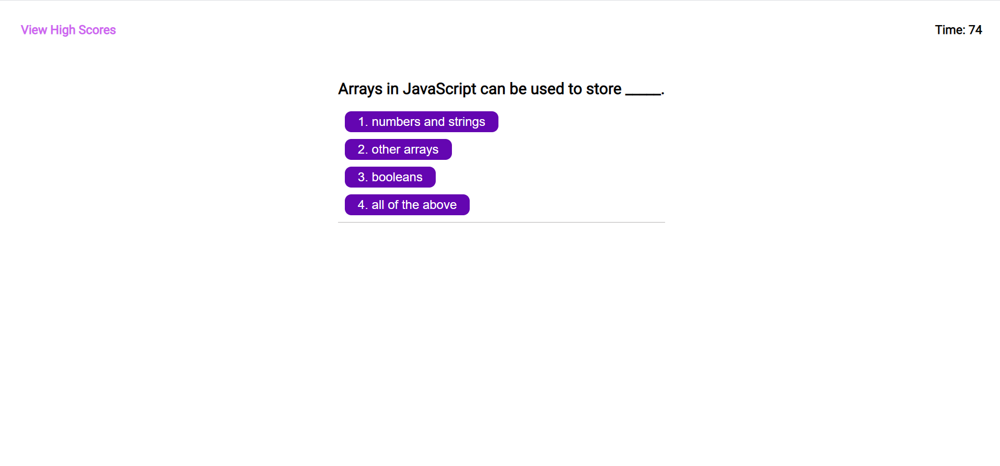
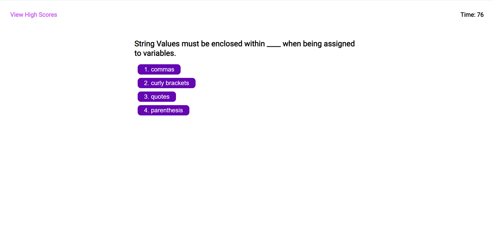
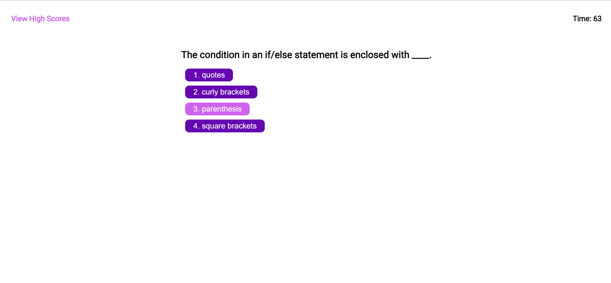
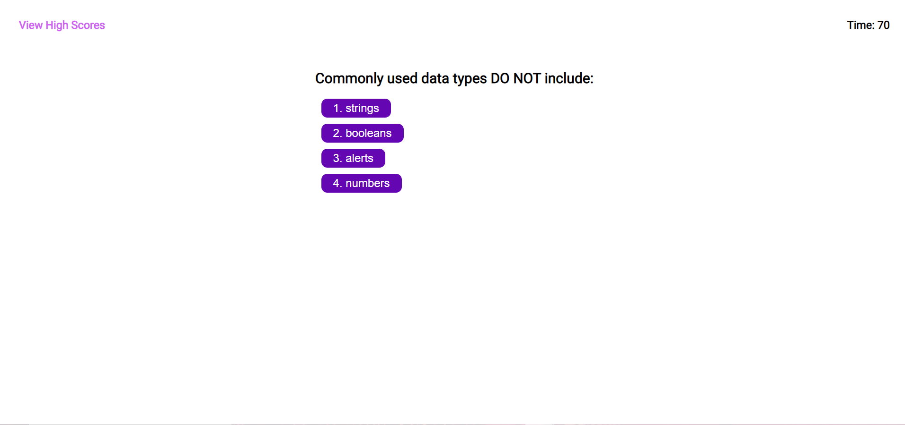
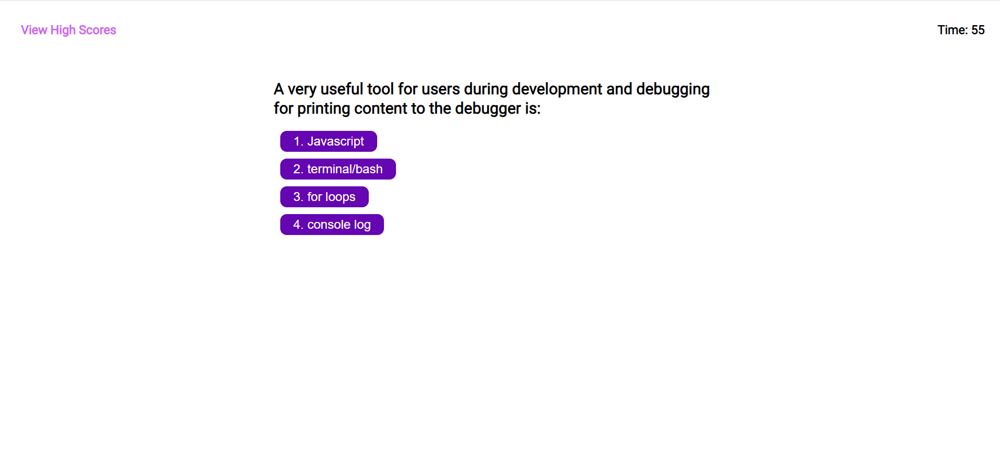
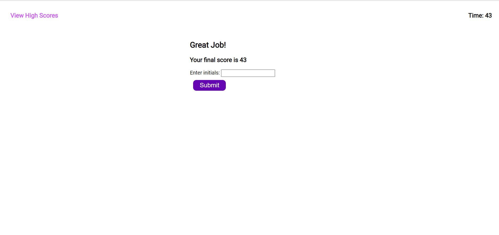
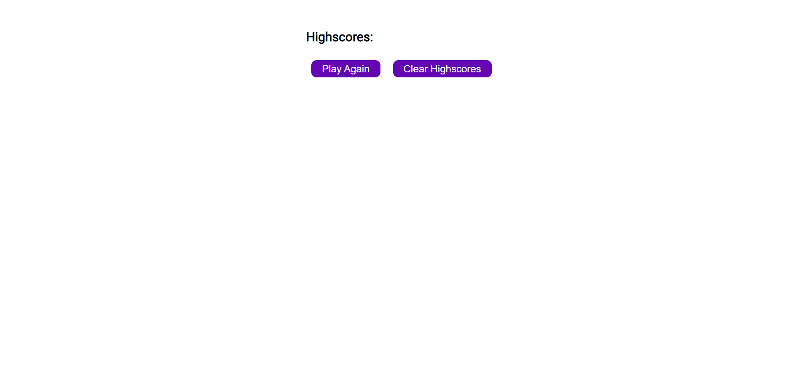
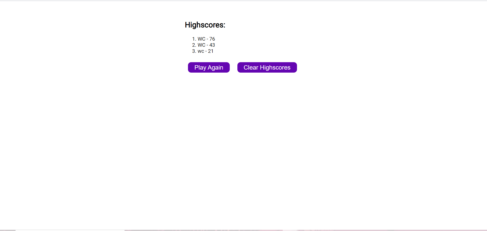

# Trivia_Game

This is a fun game I made to test your knowledge of JavaScript. It's 5 questions to see how well you know some basic JavaScript. This has been easily one of the more difficult projects I've worked on so far. With a lot of help from the internet and peers I was able to get it done. I hope you enjoy!

## Table of Contents

* [Create a functional home page with a start button](Create-a-functional-home-page-with-a-start-button)
*[Create the Questions for the Quiz](Create-the-Questions-for-the-Quiz)
*[Giving users the ability to enter initals at the end of their game](Giving-users-the-ability-to-enter-initals-at-the-end-of-their-game)
*[Highscore Page](Highscore-Page)
*[Providing a URL for the website](Providing-a-URL-for-the-website)
*[Credits](Credits)

## Create a functional home page with a start button

1. Use Javascript/HTML to create a fully functional home page with a start quiz button to begin the game and start the timer.

## Create the Questions for the Quiz

1. Use Javascript to allow the array of questions to appear on the webpage
2. Allow the player to select the correct (or wrong) answer and add to their score

  

  

  

  

## Giving users the ability to enter initals at the end of their game

1. Use Javascript to allow the player to enter their initials after completing the trivia game
2. The user will be able to see their score

## Highscore Page

1. Use JavaScript to create a function and local storage to hold the users highscore and update new highscores.

  

## Providing a URL for the website

1. Open Github.com
2. Create a new repository
3. Add a repository name and optional description
4. Make the repo public and add a README
5. Create repository
6. Inside the repo go to settings, scroll down to GitHub Pages and publish your site to the Branch: main

## Credits

* Marissa NeSmith (https://github.com/marisanesmith)
* Ethan Dutcher (https://github.com/edutcher)
* W3 Schools (https://w3schools.com)
* Kashay Arbelo (https://github.com/KashCodes)